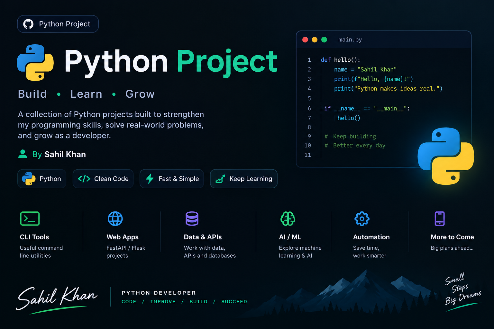

# 🚀 FastAPI Dataset Generator



A powerful **FastAPI-based dataset generation API** for creating synthetic datasets quickly and easily.

This project allows users to generate realistic fake data such as names, emails, phone numbers, locations, ages, and other fields using **Faker**, as well as machine-learning datasets using **scikit-learn**.

The generated data can be processed with **Pandas** and returned through a clean REST API.

---

## ✨ Features

* 🚀 Fast API powered by **FastAPI**
* 👤 Generate realistic fake personal data
* 📊 Generate machine-learning datasets
* 🧪 Support for synthetic/test data
* 🐼 Data processing with Pandas
* 🔢 Numerical data generation with NumPy
* 🤖 ML dataset generation with Scikit-learn
* 📄 JSON API responses
* 📚 Automatic Swagger API documentation
* ⚡ Fast and lightweight
* 🧩 Modular project structure
* 🔧 Easy to extend with new dataset types

---

## 🛠️ Technologies

| Technology   | Purpose                        |
| ------------ | ------------------------------ |
| Python       | Programming language           |
| FastAPI      | REST API framework             |
| Uvicorn      | ASGI server                    |
| Faker        | Fake/realistic data generation |
| Pandas       | Data processing                |
| NumPy        | Numerical data                 |
| Scikit-learn | Machine-learning datasets      |
| Pydantic     | Request validation             |

---

# 📁 Project Structure

```text
dataset-generator/
│
├── app/
│   │
│   ├── src/
│   │   ├── Routes/
│   │   │   └── dataset.py
│   │   │
│   │   ├── Services/
│   │   │   └── ml_dataset.py
│   │   │
│   │   ├── Schemas/
│   │   │   └── dataset.py
│   │   │
│   │   ├── main.py
│   │   │
│   │   └── ...
│   │
│   ├── .env
│   ├── .gitignore
│   ├── requirements.txt
│   └── README.md
│
└── ...
```

> The exact folder names may be adjusted as the project grows.

---

# ⚙️ Installation

## 1. Clone the repository

```bash
git clone https://github.com/YOUR_USERNAME/YOUR_REPOSITORY.git
```

Move into the project:

```bash
cd YOUR_REPOSITORY
```

---

## 2. Create a virtual environment

### Windows

```bash
python -m venv .venv
```

Activate it:

```powershell
.venv\Scripts\Activate.ps1
```

### Linux / macOS

```bash
python3 -m venv .venv
```

Activate it:

```bash
source .venv/bin/activate
```

---

# 📦 Install Dependencies

Install the required packages:

```bash
pip install -r requirements.txt
```

If you don't have a `requirements.txt` yet, install the main dependencies:

```bash
pip install fastapi uvicorn faker pandas numpy scikit-learn
```

Then save them:

```bash
pip freeze > requirements.txt
```

---

# ▶️ Run the Application

From the project root, start FastAPI with Uvicorn:

```bash
uvicorn src.main:app --reload
```

If your `main.py` is located inside another directory, adjust the module path accordingly.

For example:

```bash
uvicorn app.src.main:app --reload
```

You should see something similar to:

```text
INFO:     Uvicorn running on http://127.0.0.1:8000
```

The API is now available at:

```text
http://127.0.0.1:8000
```

---

# 📚 API Documentation

FastAPI automatically generates interactive API documentation.

## Swagger UI

Open:

```text
http://127.0.0.1:8000/docs
```

Swagger allows you to:

* View available endpoints
* See request parameters
* Send requests
* Test the API
* View responses

---

## ReDoc

FastAPI also provides ReDoc:

```text
http://127.0.0.1:8000/redoc
```

---

# 🧑‍💻 How to Use the API

The main dataset-generation API is available under:

```text
/generate_datasets
```

You can use Swagger UI to discover the available operations and test them directly.

---

# 👤 Generate Fake Person Data

The application can generate synthetic person information using Faker.

Possible fields include:

```text
first_name
last_name
name
city
country
age
phone
email
```

Example generated record:

```json
{
  "first_name": "John",
  "last_name": "Smith",
  "name": "John Smith",
  "city": "New York",
  "country": "United States",
  "age": 27,
  "phone": "+1-555-123-4567",
  "email": "john.smith@example.com"
}
```

The generated information is **synthetic data** and should not be treated as real personal information.

---

# 📊 Machine Learning Dataset Generation

The project can also generate datasets suitable for machine-learning experiments.

For example, using Scikit-learn's:

```python
make_classification()
```

the application can generate a classification dataset containing:

* Features
* Target labels
* Multiple samples
* Configurable classes
* Configurable features

Example concept:

```text
Dataset
│
├── Feature 1
├── Feature 2
├── Feature 3
├── Feature 4
├── Feature 5
│
└── Target
```

This makes the project useful for:

* Machine-learning practice
* Classification experiments
* Model testing
* Data-analysis practice
* API testing
* Development environments

---

# 🧪 Example API Workflow

A typical workflow looks like this:

```text
User
  │
  ▼
FastAPI Endpoint
  │
  ▼
Validate Request
  │
  ▼
Dataset Generator
  │
  ├── Faker
  ├── NumPy
  └── Scikit-learn
  │
  ▼
Pandas Data Processing
  │
  ▼
JSON Response
  │
  ▼
User
```

---

# 📡 Example Request

Depending on the endpoint configuration, a request can contain information such as:

```json
{
  "number_of_datasets": 100,
  "fields": [
    "first_name",
    "last_name",
    "email",
    "age"
  ]
}
```

The API processes the request and generates the requested synthetic dataset.

---

# 📤 Example Response

A response can contain generated records such as:

```json
{
  "data": [
    {
      "first_name": "Alice",
      "last_name": "Brown",
      "email": "alice@example.com",
      "age": 31
    },
    {
      "first_name": "David",
      "last_name": "Wilson",
      "email": "david@example.com",
      "age": 24
    }
  ]
}
```

The exact response structure depends on the endpoint being used.

---

# 🐍 Using the API With Python

You can also consume the API from another Python application.

Example:

```python
import requests

url = "http://127.0.0.1:8000/generate_datasets"

response = requests.post(
    url,
    json={
        "number_of_datasets": 100,
        "fields": [
            "first_name",
            "last_name",
            "email",
            "age"
        ]
    }
)

print(response.json())
```

---

# 🌐 Using the API With JavaScript

Example:

```javascript
const response = await fetch(
    "http://127.0.0.1:8000/generate_datasets",
    {
        method: "POST",
        headers: {
            "Content-Type": "application/json"
        },
        body: JSON.stringify({
            number_of_datasets: 100,
            fields: [
                "first_name",
                "last_name",
                "email",
                "age"
            ]
        })
    }
);

const data = await response.json();

console.log(data);
```

---

# 🧪 Testing With Postman

You can also test the API using Postman.

### Step 1

Start the FastAPI server:

```bash
uvicorn src.main:app --reload
```

### Step 2

Open Postman.

### Step 3

Create a request:

```text
POST http://127.0.0.1:8000/generate_datasets
```

### Step 4

Select:

```text
Body
→ raw
→ JSON
```

### Step 5

Send your JSON request.

Example:

```json
{
  "number_of_datasets": 50,
  "fields": [
    "first_name",
    "last_name",
    "email"
  ]
}
```

---

# 🖥️ Testing With Swagger

The easiest way to test the project is through Swagger.

Start the application:

```bash
uvicorn src.main:app --reload
```

Then open:

```text
http://127.0.0.1:8000/docs
```

Find the dataset-generation endpoint.

Click:

```text
Try it out
```

Enter your parameters.

Then click:

```text
Execute
```

FastAPI will display the generated response.

---

# 🔐 Environment Variables

If environment variables are required in the future, create:

```text
.env
```

Example:

```env
APP_NAME=Dataset Generator
DEBUG=True
```

Do not commit sensitive information such as:

```text
API keys
Passwords
Tokens
Database credentials
Secret keys
```

Make sure `.env` is included in `.gitignore`.

---

# 🚫 .gitignore

Recommended `.gitignore`:

```gitignore
# Python
__pycache__/
*.py[cod]
*.pyo

# Build files
build/
dist/
wheels/
*.egg-info/

# Virtual environment
.venv/
venv/
env/

# Environment variables
.env

# IDE
.vscode/
.idea/

# OS
.DS_Store
Thumbs.db

# Testing
.pytest_cache/
.coverage

# Jupyter
.ipynb_checkpoints/
```

---

# 🧠 Why This Project?

Generating test data manually is slow and repetitive.

This project provides an API that can automatically create synthetic datasets.

For example:

```text
Instead of manually creating:

User 1
User 2
User 3
...
User 10,000

The API can generate:

10,000 synthetic records
```

This is useful when developing:

* REST APIs
* Machine-learning models
* Databases
* Dashboards
* Data-analysis applications
* Testing systems

---

# 🎯 Use Cases

## 1. API Testing

Generate thousands of fake users for testing API performance.

## 2. Machine Learning

Generate datasets for classification experiments.

## 3. Database Testing

Create large amounts of synthetic records.

## 4. Data Analysis

Generate datasets for Pandas and visualization practice.

## 5. Development

Use realistic fake data without manually creating records.

---

# 🚀 Future Improvements

Planned improvements may include:

* [ ] CSV export
* [ ] Excel export
* [ ] JSON download
* [ ] Custom dataset schemas
* [ ] More Faker fields
* [ ] More machine-learning dataset types
* [ ] Regression dataset generation
* [ ] Clustering dataset generation
* [ ] Dataset preview
* [ ] Dataset size limits
* [ ] Authentication
* [ ] Database storage
* [ ] Background dataset generation
* [ ] Docker support
* [ ] Frontend dashboard
* [ ] Dataset download endpoint

---

# 🐳 Docker

Docker support can be added to make deployment easier.

Example future structure:

```text
dataset-generator/
│
├── Dockerfile
├── docker-compose.yml
├── requirements.txt
└── app/
```

Then the application can be run with:

```bash
docker compose up --build
```

---

# ⚡ Performance

FastAPI is designed for high-performance API development.

The project uses asynchronous API endpoints where appropriate and separates the API layer from dataset-generation logic.

The architecture can be extended later with:

```text
FastAPI
   │
   ├── Services
   │
   ├── Dataset Generators
   │
   ├── Database
   │
   └── Background Tasks
```

---

# 🤝 Contributing

Contributions are welcome.

### 1. Fork the repository

```bash
git fork
```

### 2. Create a branch

```bash
git checkout -b feature/new-feature
```

### 3. Make your changes

### 4. Commit your changes

```bash
git add .
git commit -m "Add new dataset generator"
```

### 5. Push your branch

```bash
git push origin feature/new-feature
```

### 6. Create a Pull Request

---

# 📄 License

This project is available for educational and development purposes.

You can add a specific open-source license such as MIT if you want to distribute the project under that license.

---

# 👨‍💻 Author

**Sahil Khan**

Python Developer | FastAPI | Machine Learning | AI

Building projects, learning new technologies, and turning ideas into working software.

---

# ⭐ Support

If you find this project useful:

⭐ Star the repository
🍴 Fork the repository
🐛 Report issues
💡 Suggest improvements

---

## 💙 Developer Journey

```text
Learn → Build → Break → Debug → Improve → Repeat
```

**Keep building. Keep learning. Keep improving.**

Made with ❤️ and Python by **Sahil Khan** 🐍
